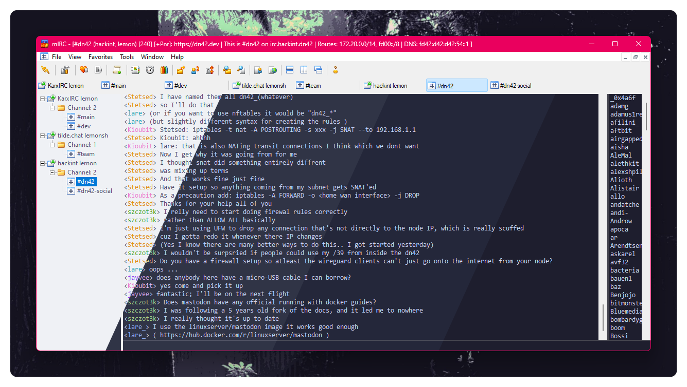
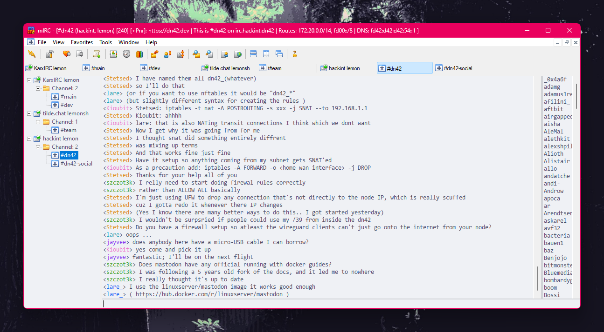
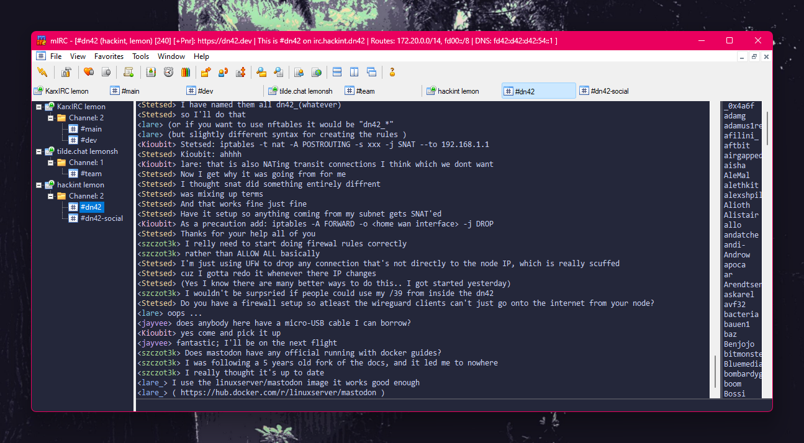
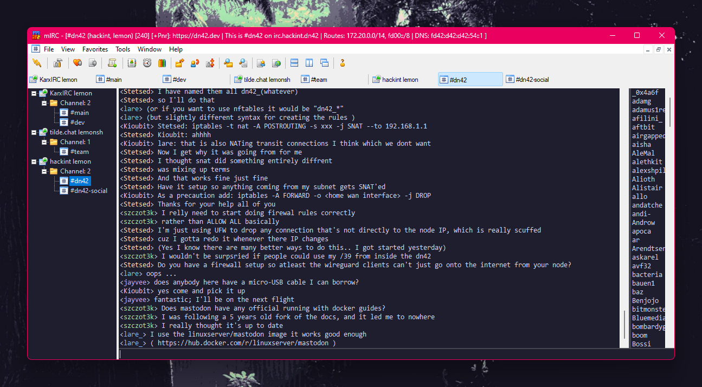

<h3 align="center">
	<br/>
	
	Catppuccin for <a href="https://www.mirc.com/">mIRC</a>
	
</h3>

<p align="center">
	<a href="https://github.com/lemon-sh/mirc/stargazers"></a>
	<a href="https://github.com/lemon-sh/mirc/issues"></a>
	<a href="https://github.com/lemon-sh/mirc/contributors"></a>
</p>

<p align="center">
	
</p>

## Previews

<details>
<summary>🌻 Latte</summary>

</details>
<details>
<summary>🪴 Frappé</summary>

</details>
<details>
<summary>🌺 Macchiato</summary>

</details>
<details>
<summary>🌿 Mocha</summary>

</details>

## Usage

**Note:** The format of the mIRC configuration file is not very human-friendly, so be sure to make a backup of your config before proceeding.

<details>
<summary>
<h3>If you do <b>NOT</b> want to retain the themes you already have (including the default ones)</h3>
</summary>

1. Open `%appdata%\mIRC\mirc.ini` with a text editor
2. Replace the `[colors]` and `[palettes]` sections with the contents of [catppuccin.ini](catppuccin.ini)

</details>
<details>
<summary>
<h3>If you <b>DO</b> want to retain the themes you already have</h3>
</summary>

1. Open your mIRC config `%appdata%\mIRC\mirc.ini` with a text editor
2. Append the entries from the `[colors]` section in the [catppuccin.ini](catppuccin.ini) to the `[colors]` section in your mIRC config file
3. Do the same for `[palettes]`
4. Correct the numbering so that the key starts from `n0` and is incremented by one on every row.

You should end up with something like this:

```ini
[colors]
n0=mIRC Classic,0,6,4,5,2,3,3,3,3,3,3,1,5,7,6,1,3,2,3,5,1,0,1,0,1,14,6,0,0,1,97
n1=mIRC Modern,0,6,4,7,2,3,4,3,3,3,3,1,5,2,6,1,14,2,3,5,1,0,1,0,1,14,5,0,0,1,97
n2=Monochrome State,1,15,15,15,15,15,15,15,15,15,15,15,15,15,15,15,15,15,15,15,15,1,15,1,15,15,15,14,1,15,97
n3=Placid Hues,0,2,4,7,2,3,3,3,3,15,3,1,5,7,6,1,3,2,3,5,1,0,1,0,1,15,6,0,0,1,97
n4=Rainbow Sky,0,7,4,5,1,1,3,3,8,13,3,14,2,7,13,5,3,8,3,4,14,0,5,0,3,14,10,0,0,1,97
n5=Catppuccin Latte,0,11,4,11,2,3,10,10,6,3,3,1,10,13,12,1,7,6,10,5,4,0,1,0,1,14,6,0,0,1,0
n6=Catppuccin Frappé,0,11,4,11,2,3,10,10,6,3,3,1,10,13,12,1,7,6,10,5,4,0,1,0,1,14,6,0,0,1,0
n7=Catppuccin Macchiato,0,11,4,11,2,3,10,10,6,3,3,1,10,13,12,1,7,6,10,5,4,0,1,0,1,14,6,0,0,1,0
n8=Catppuccin Mocha,0,11,4,11,2,3,10,10,6,3,3,1,10,13,12,1,7,6,10,5,4,0,1,0,1,14,6,0,0,1,0

[palettes]
n0=16777215,0,8323072,37632,255,127,10223772,32764,65535,64512,9671424,16776960,16515072,16711935,8355711,13816530
n1=16777215,0,11010048,3299627,240,4737160,8388720,26832,1632504,57344,94740,16776960,16515072,16711935,8355711,13816530
n2=16777215,0,8323072,37632,255,127,10223772,32764,65535,64512,9671424,16776960,16515072,16711935,8355711,13816530
n3=15658734,0,12140,1508038,255,10964547,6579262,33023,65535,4227072,9474048,9920537,16711680,16711935,6579300,8553090
n4=16777215,3618615,12087408,16744448,255,32764,65535,43008,9671424,16776960,16515072,16711935,8355711,16711808,8355711,13816530
n5=16118255,6901580,7899868,7895261,13334250,15677832,3739602,5457382,746750,1937119,2859072,10064407,15049988,11902752,16082462,16615282
n6=4600880,16109766,13620722,12500718,14989556,15113930,8684263,10263018,7774191,9488613,9032102,12503169,14406041,14467461,15641228,15842234
n7=3811108,16110538,14081012,13027056,15121909,16163014,9865197,11313387,8366581,10474734,9820838,13292939,14931857,14992509,16035210,16301495
n8=3022366,16045773,14475509,13487602,15188725,16230091,11045875,11313387,8893434,11526905,10609574,14017172,15457417,15517556,16430217,16694964
```

</details>

## 💝 Thanks to

- [lemonsh](https://github.com/lemon-sh)

&nbsp;

<p align="center">
	
</p>

<p align="center">
	Copyright &copy; 2021-present <a href="https://github.com/catppuccin" target="_blank">Catppuccin Org</a>
</p>

<p align="center">
	<a href="https://github.com/catppuccin/catppuccin/blob/main/LICENSE"></a>
</p>
